# CVEs, Older Releases, Forks, Variants and Scanner Behaviour

**Research note — September 2026**

This document consolidates the investigation into how prominent open-source projects handle vulnerabilities in older releases, what happens when software has forks or downstream variants, and how vulnerability scanners behave when public CVE data is incomplete.

The central finding is simple:

> **A CVE does not propagate a vulnerability through the software ecosystem.**

CVE provides an identifier and a vulnerability record. It does not maintain software ancestry, discover every fork or embedded copy, determine whether vulnerable code is still present in each derivative, or ensure that every scanner reaches the same conclusion.

That creates a particularly important failure mode for old and end-of-life (EOL) software: a version can still contain vulnerable code while public vulnerability data is incomplete, stale, or silent.

---

## 1. Scope

The investigation covered three related questions:

1. What do prominent open-source projects say about fixing CVEs in older releases?
2. What happens when those projects have forks, derivatives, vendor variants or embedded copies?
3. Which scanners and vulnerability databases go beyond simply consuming NVD/CPE data and independently assess affected versions?

The projects reviewed were:

- Apache Tomcat
- Apache HTTP Server
- Node.js
- CPython
- Django
- PostgreSQL
- Kubernetes
- Go
- OpenSSL
- Linux kernel
- Spring Framework
- Redis

The scanner/data sources reviewed included:

- Sonatype Lifecycle / IQ / OSS Index
- Black Duck SCA / BDSA
- Snyk Open Source
- Mend SCA
- JFrog Xray
- GitHub Advisory Database / Dependabot
- OSV
- Grype
- distribution-specific security feeds

This is **not** a formal benchmark of every commercial scanner. Some commercial vulnerability intelligence is only visible to customers, so those products cannot be scored conclusively without running the same test artifacts through them.

---

# 2. The support-policy problem starts before scanning

Projects do not all treat older releases in the same way.

A useful model is:

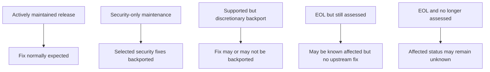

The key distinction is between:

- **not fixed**
- **not assessed**
- **not affected**

Those are not equivalent.

A scanner may only be able to tell you what the public data says. If the project no longer assesses an old release, “no CVE is listed” can simply mean “nobody checked.”

---

# 3. What major projects say about old releases

## Apache Tomcat

Tomcat is one of the clearest examples.

The project publishes security information separately for supported release families and explicitly documents EOL status for older lines.

For Tomcat 8.5, the project states that vulnerabilities reported after its EOL date are not fixed.

Source:

- <https://tomcat.apache.org/security-8.html>

The important practical consequence is that post-EOL vulnerability applicability may initially be unknown. If somebody later establishes that an old release is affected, the CVE record may be updated, but the historical Tomcat security page is not necessarily maintained as if the branch were still supported.

This makes Tomcat an excellent workshop example because the project itself distinguishes:

```text
supported release
    -> investigated
    -> fixed
    -> advisory maintained

EOL release
    -> no normal investigation
    -> no upstream patch
    -> applicability may remain unknown
```

---

## Apache HTTP Server

Apache HTTP Server takes a similarly explicit position for EOL branches.

The Apache HTTP Server 2.2 security page states that vulnerabilities discovered after EOL are not investigated for that branch, even where the old code may still be affected.

Source:

- <https://httpd.apache.org/security/vulnerabilities_22.html>

This is a stronger statement than “we do not patch 2.2.”

It means the project may not even produce the data required for a scanner to determine whether 2.2 is affected.

---

## Node.js

Node.js has one of the strongest public EOL policies.

Node has a defined Active LTS / Maintenance LTS lifecycle. After EOL, releases no longer receive security patches.

More importantly, the project also states that it does not intend to continue evaluating every new CVE against EOL release lines.

Sources:

- <https://nodejs.org/en/about/eol>
- <https://nodejs.org/en/about/previous-releases>

That gives us the exact failure mode:

```text
new Node vulnerability
       |
       v
supported versions assessed and patched
       |
       +------ EOL versions may still contain the vulnerable code
                           |
                           v
                  no ongoing assessment
```

---

## CPython

CPython uses a security-only maintenance period before EOL.

Older supported Python branches can receive security fixes without receiving normal feature or bug-fix maintenance. After the security-support period ends, the branch becomes frozen and is no longer maintained.

Sources:

- <https://devguide.python.org/security/policy/>
- <https://devguide.python.org/developer-workflow/development-cycle/>

This is a useful counter-example to Tomcat and Node because Python deliberately retains old branches for security maintenance before finally stopping.

---

## Django

Django distinguishes supported releases, long-term support releases, and unsupported release lines.

Older unsupported series explicitly stop receiving both bug fixes and security updates.

Source:

- <https://www.djangoproject.com/download/>

Django is also important because it has a formal distributor-coordination process for embargoed vulnerabilities. That becomes relevant later when looking at how security information reaches downstream projects.

Source:

- <https://docs.djangoproject.com/en/6.1/internals/security/>

---

## PostgreSQL

PostgreSQL normally supports each major release for approximately five years.

During that period, minor releases can contain security fixes. After the final release in the support period, the old major version is unsupported.

Source:

- <https://www.postgresql.org/support/versioning/>

PostgreSQL is also a CNA for PostgreSQL and certain related projects, which makes it an interesting example of a project that participates directly in the CVE assignment process.

Source:

- <https://www.postgresql.org/support/security/>

---

## Kubernetes

Kubernetes supports a relatively small number of recent minor releases.

Security fixes may be backported to supported branches, but backporting is not an unconditional promise for every issue. Severity, feasibility and release policy matter.

Source:

- <https://kubernetes.io/releases/version-skew-policy/>

This creates a third category:

```text
supported != guaranteed backport
```

A release can still be supported while a particular fix is impractical or intentionally not backported.

---

## Go

Go supports the two most recent major Go releases.

Critical problems, including critical security problems, are fixed in the supported releases.

Source:

- <https://go.dev/doc/devel/release>

Anything older falls outside that maintenance commitment.

---

## OpenSSL

OpenSSL maintains several release lines, including long-term support releases.

Supported release lines receive security fixes during their maintenance window. Unsupported versions do not receive normal updates.

Sources:

- <https://openssl-library.org/policies/releasestrat/>
- <https://openssl-library.org/news/vulnerabilities/>

OpenSSL is especially important because it also has multiple major independent descendants.

---

## Linux kernel

The Linux kernel has a mainline, stable and long-term maintenance model.

Fixes may be backported to older stable kernels, but backporting is not automatic. Some changes are too invasive or risky to backport safely.

Source:

- <https://www.kernel.org/releases.html>
- <https://www.kernel.org/doc/html/latest/process/stable-kernel-rules.html>

Linux therefore demonstrates that even a heavily maintained ecosystem can have different security states across code lines.

---

## Spring Framework

Spring primarily accepts security reports and provides security fixes for supported release lines.

Older EOL branches do not continue receiving normal community security maintenance.

Source:

- <https://github.com/spring-projects/spring-framework/security>
- <https://github.com/spring-projects/spring-framework/wiki/Spring-Framework-Versions>

Spring is less interesting as a pure fork example, but very interesting as a “multiple support owners” example because older lines may continue to receive fixes through commercial maintenance channels.

---

## Redis

Redis now has a particularly useful statement for fork and old-release handling.

Its security policy makes security patches available in ways that can permit use by older releases or forks, but explicitly notes:

> “Applicability or portability to other versions or forks has not been evaluated.”

Source:

- <https://github.com/redis/redis/security>

That sentence captures the core issue:

```text
we know the bug
we know our fix
we do not know whether every old branch or fork is affected
we do not know whether our patch cleanly applies there
```

---

# 4. Forks, variants and derivatives

A raw GitHub fork count is not especially useful for security analysis.

What matters is whether there is another maintained code line that can diverge from upstream.

There are several different relationships:

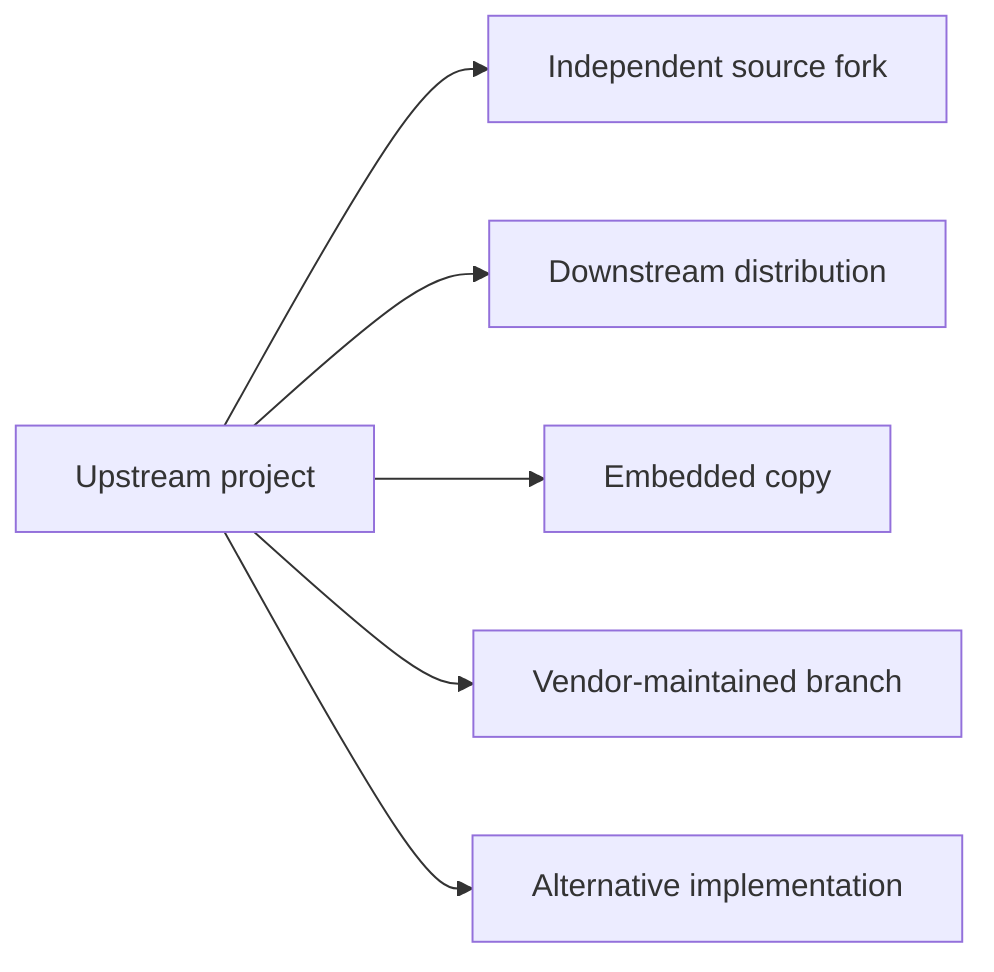

These relationships do not behave the same way.

---

## Strong independent fork families

### OpenSSL family

OpenSSL has a genuine, historically significant fork family.

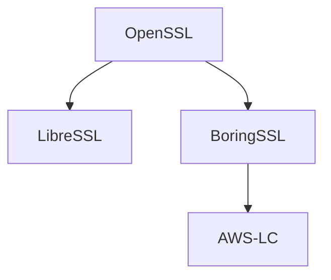

BoringSSL describes itself as a fork of OpenSSL.

Source:

- <https://boringssl.googlesource.com/boringssl>

AWS-LC describes itself as a fork of BoringSSL, which itself descends from OpenSSL.

Source:

- <https://github.com/aws/aws-lc>

LibreSSL is another independent OpenSSL-derived codebase.

Source:

- <https://github.com/libressl/portable>

The important point is that CVE does not maintain this genealogy.

If a vulnerable function originated in OpenSSL and survives in all descendants, somebody still has to determine whether each descendant is affected.

---

### Redis and Valkey

Valkey is the clearest current Redis fork.

The relationship is now:

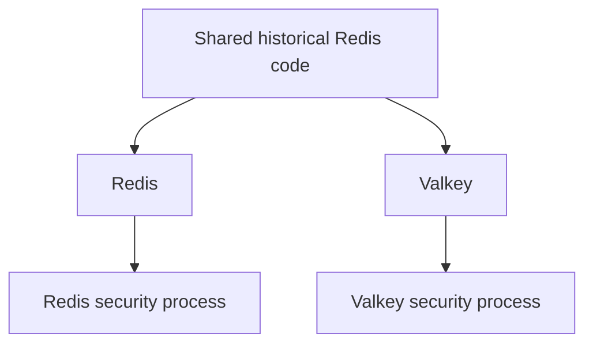

Redis and Valkey now operate independent security processes.

Redis does not guarantee that its security patches are applicable to forks.

Valkey accepts its own private security reports and can coordinate with Valkey vendors.

Source:

- <https://github.com/valkey-io/valkey/security>

This means that a vulnerability discovered in one branch does not automatically become a vulnerability record for the other.

---

# 5. Derivative and embedded ecosystems

## Tomcat

Tomcat has several significant downstream forms.

Examples include:

- Apache TomEE
- Red Hat JBoss Web Server
- other application servers and vendor distributions embedding or repackaging Tomcat

TomEE is particularly explicit about its process. It tracks Tomcat security fixes and may publish a TomEE security update by updating or backporting the Tomcat changes.

Source:

- <https://tomee.apache.org/security/security.html>

This is not automatic CVE propagation.

It is maintainers knowing that TomEE contains Tomcat and consciously monitoring upstream security work.

---

## Apache HTTP Server

Apache HTTP Server is distributed inside several vendor products, including:

- IBM HTTP Server
- Red Hat JBoss Core Services HTTP Server
- Oracle HTTP Server

Vendor advisories often exist because the vendor has independently assessed whether the Apache HTTP Server vulnerability applies to its shipped build.

Example IBM security-bulletin pattern:

- <https://www.ibm.com/support/pages/security-bulletin-ibm-http-server-affected-multiple-vulnerabilities-due-included-apache-http-server-0>

Again, the relationship is maintained by the vendor, not by the CVE system.

---

## Node.js

Electron is an especially useful Node downstream example.

Electron embeds Node.js and maintains its own release lines.

Electron explicitly documents that security-only branches can receive security-related changes from Node releases without consuming the entire upstream release.

Source:

- <https://www.electronjs.org/docs/latest/tutorial/electron-timelines>

That produces this flow:

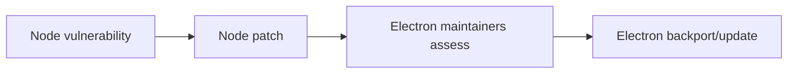

---

## Python

Python has a mixture of:

- CPython itself
- PyPy
- GraalPy
- historical direct forks such as Cinder
- the newer CinderX extension model

These are not all direct forks of current CPython.

That matters because a CVE in CPython may:

- affect PyPy too
- not affect PyPy at all
- require a completely different fix
- affect only CPython internals

GraalPy can import CPython fixes where relevant, but applicability still has to be established for the alternative implementation.

---

## Kubernetes

Kubernetes has an enormous downstream distribution ecosystem:

- K3s
- RKE2
- OpenShift
- managed cloud Kubernetes products
- numerous certified distributions

Kubernetes is important because it has a formal private-distributor coordination mechanism.

Its Security Response Committee can coordinate vulnerability handling before public disclosure.

Source:

- <https://github.com/kubernetes/committee-security-response>

This is much more structured than “downstream vendors watch GitHub.”

---

## Linux

Linux is probably the largest variant ecosystem of all.

Examples include:

- upstream stable kernels
- long-term kernels
- Red Hat kernels
- Ubuntu kernels
- SUSE kernels
- Android kernels
- hardware-vendor kernels
- device-specific downstream trees

A vulnerability can therefore exist in multiple descendants with completely different patch states.

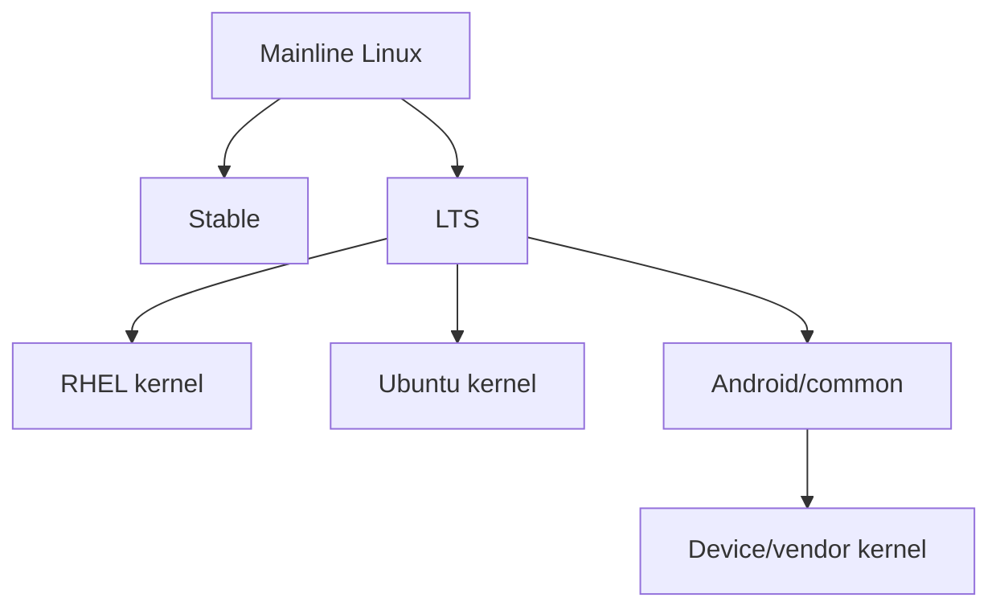

The security problem is not just “is Linux affected?”

It is:

> Which exact kernel lineage contains the vulnerable code, and has that lineage received the relevant fix?

---

# 6. How a CVE actually propagates

The naive model is:

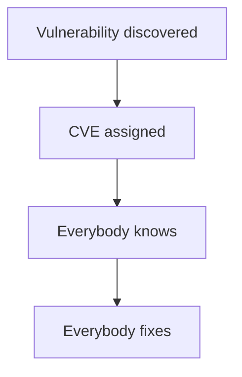

That model is wrong.

A more realistic model is:

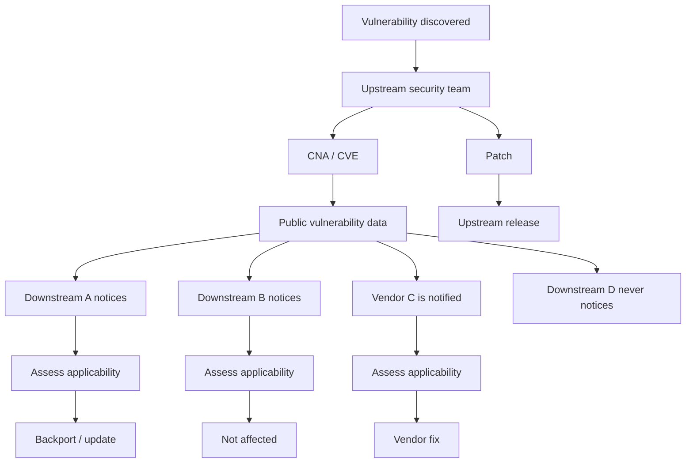

The arrows between the projects are mostly organisational processes.

CVE itself does not:

- discover descendants
- maintain a fork tree
- inspect source history
- identify embedded copies
- decide whether an old release contains the same vulnerable function
- ensure every derivative is notified
- generate backports

---

# 7. Formal propagation mechanisms

Some ecosystems do have explicit coordination mechanisms.

## Kubernetes

Kubernetes has:

- a Security Response Committee
- private vulnerability handling
- coordinated disclosure
- downstream/distributor notification

This is one of the strongest examples of an organised cross-distribution security process.

---

## Django

Django also has a private distributor process.

Before disclosure, selected distributors can receive:

- a description of the issue
- affected Django versions
- the patch
- planned disclosure timing

Source:

- <https://docs.djangoproject.com/en/6.1/internals/security/>

---

## Linux

Linux has private security-reporting mechanisms and separate distributor coordination practices.

The important distinction is between:

1. fixing the issue upstream
2. coordinating downstream distribution response

Those are not the same process.

Source:

- <https://www.kernel.org/doc/html/latest/process/security-bugs.html>

---

# 8. What happens when the vulnerability is discovered in a fork?

There are three main cases.

## Case 1 — fork-specific vulnerability

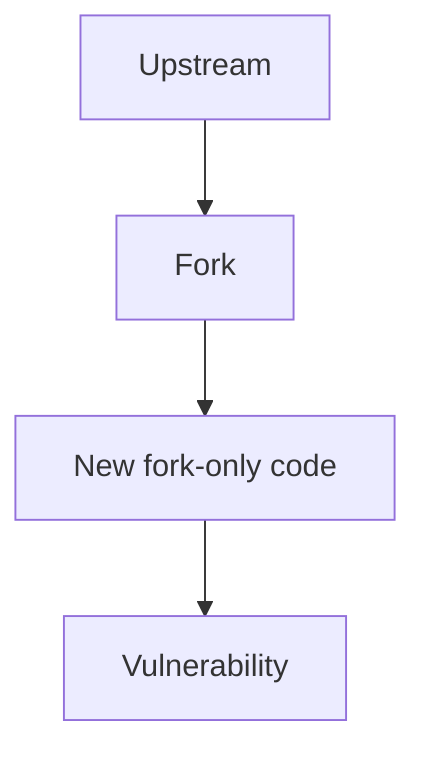

The vulnerability belongs to the fork.

There may be nothing to send upstream.

---

## Case 2 — inherited upstream vulnerability

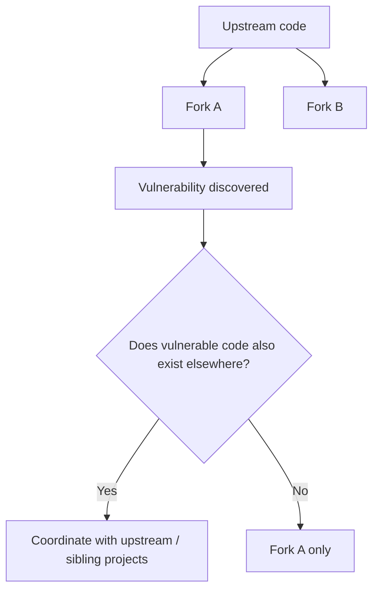

Somebody has to perform the source-history analysis.

CVE does not do that automatically.

---

## Case 3 — shared vulnerability is never recognised

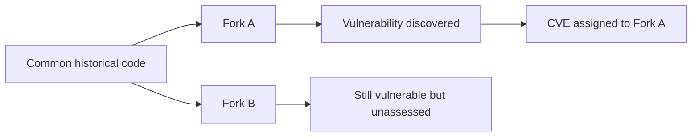

This is the dangerous case.

Fork B can remain vulnerable while:

- no CVE explicitly names it
- no CPE names it
- no package advisory maps it
- no scanner alerts on it

That is a **false sense of absence**, not evidence of safety.

---

# 9. The scanner problem

Scanner vendors broadly fall into three classes.

## Class 1 — feed consumers

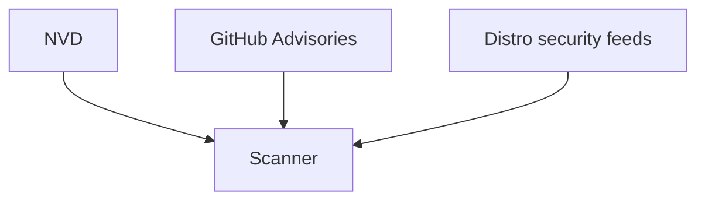

Typical behaviour:

- consume existing vulnerability records
- map package identity/version to published affected ranges
- inherit errors and omissions in those feeds

Examples include:

- Dependabot, when it has a reviewed GitHub Advisory package mapping
- Grype for many ecosystems
- many basic SCA implementations

The problem is straightforward:

> Missing affected-version data in → missing scanner result out.

---

## Class 2 — enriched vulnerability intelligence

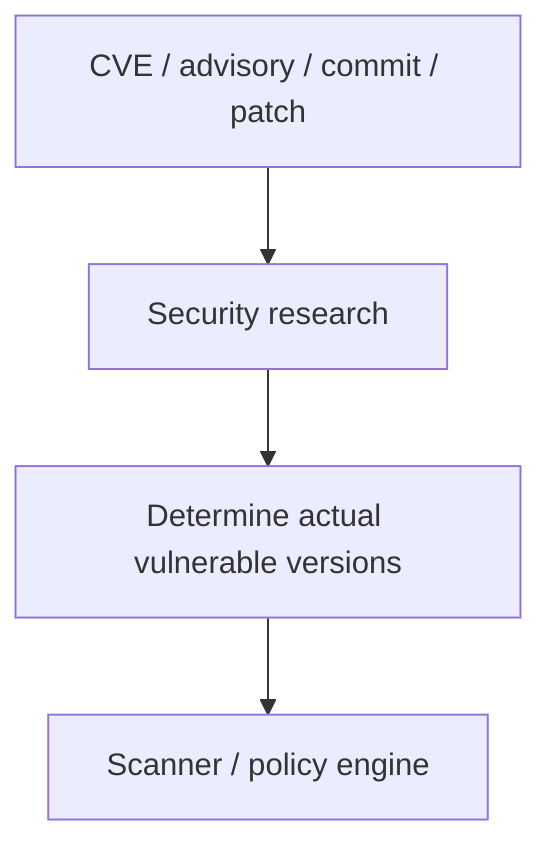

These vendors explicitly claim to research or correct version applicability.

### Sonatype

Sonatype says its researchers determine vulnerable version ranges rather than merely accepting public data as authoritative.

Sources:

- <https://help.sonatype.com/en/sonatype-vulnerability-data.html>
- <https://www.sonatype.com/state-of-the-software-supply-chain/2026/methodology>

Sonatype also has an explicit Component-EOL capability:

- <https://help.sonatype.com/en/component-end-of-life.html>

A particularly useful Sonatype concept is the **Deviation Notice**, used where Sonatype's own research differs from public vulnerability reporting.

Example:

- <https://ossindex.sonatype.org/vulnerability/CVE-2025-48989>

This is strong evidence that Sonatype does not simply mirror NVD.

---

### Black Duck

Black Duck maintains Black Duck Security Advisories (BDSA).

Its documentation states that researchers cross-check vulnerabilities against potentially affected component versions and that this can produce additional or more accurate mappings than public sources.

Source:

- <https://docs.blackduck.com/>

Black Duck therefore appears to fit the same enriched-intelligence category as Sonatype.

However, exact BDSA mappings are usually visible in the commercial product, so this investigation could not independently score each test CVE.

---

### Snyk

Snyk maintains its own vulnerability database and security-research process.

Sources include:

- CVEs
- GitHub issues
- pull requests
- commits
- automated research
- manual research

Snyk then assigns package/version ranges itself.

Source:

- <https://docs.snyk.io/scan-with-snyk/snyk-open-source/manage-vulnerabilities/snyk-vulnerability-database>

Snyk's public data therefore provides a useful way to compare its version-range decisions with NVD, GitHub and OSV.

The important finding is that **independent research still does not make Snyk consistently correct for EOL versions**.

---

## Class 3 — application-context analysis

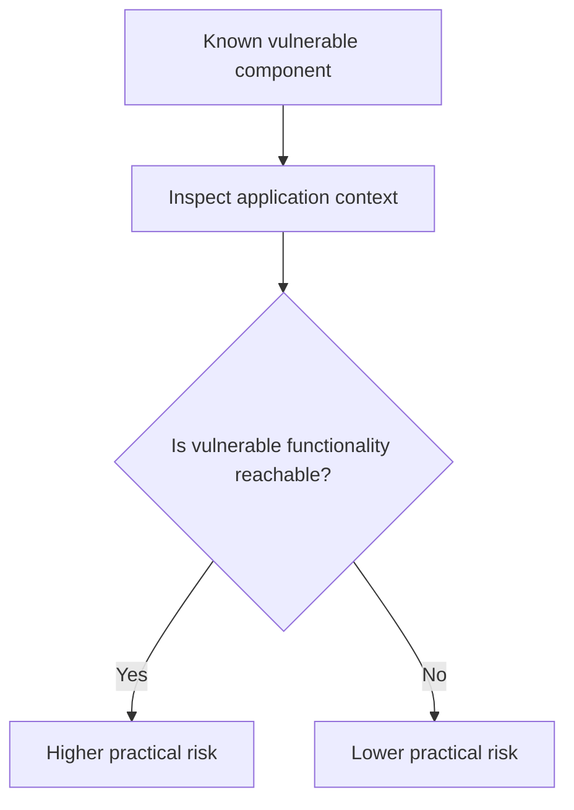

Examples include:

- JFrog Xray Contextual Analysis
- Snyk reachability/triage features
- Mend prioritisation

These features answer a different question:

> Is this known vulnerability exploitable in this application?

They do **not** necessarily answer:

> Does this old release contain a vulnerability that the public CVE record forgot to list?

That distinction matters.

---

# 10. Grype demonstrates the EOL data problem explicitly

Grype relies on upstream security feeds for many OS ecosystems.

Its documentation warns that once an operating system is EOL, the security feeds it depends on may stop receiving updates.

Source:

- <https://oss.anchore.com/docs/guides/vulnerability/ecosystems/>

That produces:

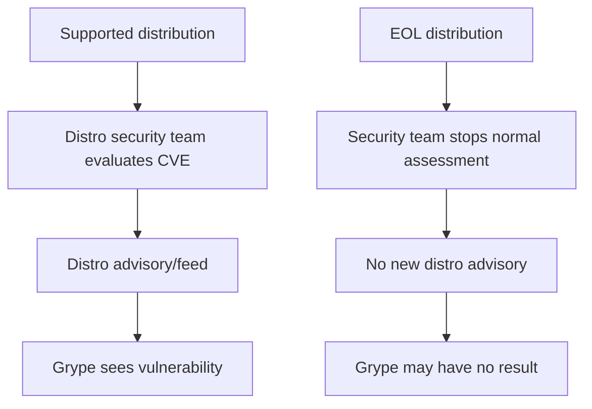

This is not a Grype bug.

It is a consequence of the data source disappearing.

---

# 11. GitHub / Dependabot also has coverage limits

Dependabot depends heavily on GitHub Advisory Database package mappings.

GitHub distinguishes:

- reviewed advisories with package/version ranges
- unreviewed advisories
- CVEs that have no usable package mapping

If an advisory has no supported package mapping, Dependabot may not generate an alert even though the CVE exists.

Source:

- <https://docs.github.com/en/code-security/reference/supply-chain-security/troubleshoot-dependabot/vulnerability-detection>

This becomes very visible in the Node and Tomcat examples below.

---

# 12. Empirical mini-study: Tomcat EOL versions

The investigation compared public data for several Tomcat CVEs against known EOL Tomcat versions.

This was **not** a live scan of every commercial product.

It was a comparison of the public advisory/package/version data that those scanners or ecosystems expose.

## Test versions

Two especially useful old versions are:

```text
org.apache.tomcat:*:8.5.100
org.apache.tomcat:*:7.0.109
```

Both represent EOL Tomcat lines.

---

## CVE-2024-38286

Known affected old releases include:

- Tomcat 8.5.100
- Tomcat 7.0.109

NVD's page includes CNA information that acknowledges the older lines, while the NVD CPE configuration is narrower and begins with newer Tomcat.

Source:

- <https://nvd.nist.gov/vuln/detail/CVE-2024-38286>

### Snyk

Snyk's public Maven mapping starts at Tomcat 9.0.13.

Result for the old versions:

**Miss**

Source:

- <https://security.snyk.io/vuln/SNYK-JAVA-ORGAPACHETOMCAT-8073089>

### GitHub Advisory Database

GitHub's reviewed advisory explicitly maps the older Maven ranges, including 8.5 and 7.x.

Result:

**Hit**

Source:

- <https://github.com/advisories/GHSA-7jqf-v358-p8g7>

### OSV

The GitHub-derived OSV record also contains those old ranges.

Result:

**Hit**

Source:

- <https://osv.dev/vulnerability/GHSA-7jqf-v358-p8g7>

### Why this case matters

This is a very useful counter-example to the idea that proprietary research always has broader historical coverage.

For this CVE:

```text
GitHub curated data -> old versions recognised
Snyk public Maven range -> old versions omitted
```

---

# 13. CVE-2026-24880

Tomcat 8.5.100 and 7.0.109 are known affected.

### Snyk

Snyk uses a range equivalent to:

```text
>= 7.0.0 and < 9.0.116
```

That deliberately spans:

- 7.x
- 8.5.x
- 9.x

Result:

**Hit**

Source:

- <https://security.snyk.io/vuln/SNYK-JAVA-ORGAPACHETOMCAT-15990632>

### GitHub

GitHub similarly maps the old Maven versions.

Result:

**Hit**

Source:

- <https://github.com/advisories/GHSA-563x-q5rq-57qp>

### OSV

OSV records also span the old releases.

Result:

**Hit**

Source:

- <https://osv.dev/vulnerability/BIT-tomcat-2026-24880>

---

# 14. CVE-2026-59083

Tomcat 8.5 is known affected.

### Snyk

Snyk's public Maven range begins at the Tomcat 9.0 milestone line.

Result for 8.5:

**Miss**

Source:

- <https://security.snyk.io/vuln/SNYK-JAVA-ORGAPACHETOMCAT-19348777>

### GitHub

GitHub knows about the vulnerability in prose, but the advisory is unreviewed and has no usable package mapping.

Result for Dependabot-style package matching:

**No reliable package alert**

Source:

- <https://github.com/advisories/GHSA-hcjr-322h-429r>

### OSV

CVE-derived OSV information can still contain the older affected line.

This demonstrates that:

```text
GitHub advisory prose
GitHub package mapping
OSV CVE record
```

can all have different levels of completeness.

---

# 15. CVE-2025-24813

This is a particularly useful workshop case because Tomcat 8.5 is known affected and the vulnerability later became highly visible.

Tomcat 8.5.0 through 8.5.100 are affected.

Source:

- <https://osv.dev/vulnerability/CVE-2025-24813>

### Snyk

Snyk's public Maven record for the relevant Tomcat package begins with the Tomcat 9 line.

Result for 8.5:

**Miss**

Source:

- <https://security.snyk.io/vuln/SNYK-JAVA-ORGAPACHETOMCAT-9380766>

### GitHub

GitHub's reviewed advisory explicitly maps the 8.5 line.

Result:

**Hit**

Source:

- <https://github.com/advisories/GHSA-83qj-6fr2-vhqg>

### OSV

OSV also contains old-version knowledge, depending on the source record/package mapping consumed.

---

# 16. CVE-2024-50379

Tomcat 8.5 is explicitly affected.

Source:

- <https://osv.dev/vulnerability/CVE-2024-50379>

### Snyk

Snyk correctly includes the 8.5 line.

Result:

**Hit**

Source:

- <https://security.snyk.io/vuln/SNYK-JAVA-ORGAPACHETOMCAT-8523184>

### GitHub

GitHub also explicitly maps 8.5.

Result:

**Hit**

Source:

- <https://github.com/advisories/GHSA-5j33-cvvr-w245>

### OSV

OSV is more complicated because separate upstream records can model package/version ranges differently.

A CVE-derived record can know 8.5 is affected while a Bitnami package record may begin later.

This is important because:

> “OSV says X” is not always a single answer.

OSV aggregates multiple data sources.

---

# 17. Tomcat comparison summary

| CVE | Old/EOL Tomcat affected? | Snyk public range | GitHub package mapping | OSV |
|---|---:|---:|---:|---:|
| CVE-2024-38286 | Yes | Miss | Hit | Hit |
| CVE-2026-24880 | Yes | Hit | Hit | Hit |
| CVE-2026-59083 | Yes | Miss | No reliable reviewed mapping | CVE data can know |
| CVE-2025-24813 | Yes | Miss | Hit | Hit / source-dependent |
| CVE-2024-50379 | Yes | Hit | Hit | Mixed by source record |

The important result is not the small score.

The important result is:

> **The answer changes by CVE and by intelligence provider.**

Independent research improves data quality, but it does not create a universal authoritative answer.

---

# 18. Node.js: an even cleaner example

## CVE-2025-59466

Node's January 2026 security release covers supported release lines and illustrates the EOL problem very clearly.

Source:

- <https://nodejs.org/en/blog/vulnerability/december-2025-security-releases>

The public ecosystem produces different machine-readable answers.

### Primary CVE / OSV

The primary CVE-derived OSV record enumerates currently supported Node release lines such as:

- 20
- 22
- 24
- 25

Source:

- <https://osv.dev/vulnerability/CVE-2025-59466>

### Snyk

Snyk's upstream Node record reaches back below Node 20.

Source:

- <https://security.snyk.io/vuln/SNYK-UPSTREAM-NODE-14975915>

This is the behaviour we were originally looking for:

> Snyk's research can model older affected releases even where the primary CVE range is focused on supported releases.

### Bitnami / OSV

Bitnami's OSV data models the range from version zero up to the fixed supported version.

This effectively treats older historical versions as affected unless fixed.

### Ubuntu / OSV

Ubuntu's distro-specific intelligence can identify older Node packages such as Node 18 and even much older package lines in supported extended-maintenance contexts.

### GitHub

GitHub's advisory for the same vulnerability is unreviewed, has no package mapping and therefore cannot drive a normal Dependabot package alert.

That gives us:

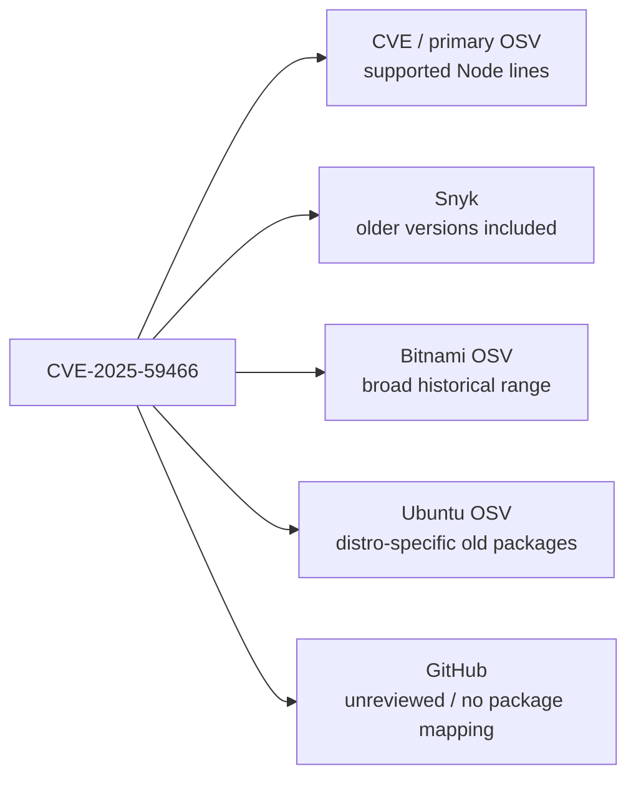

This is one of the strongest demonstrations that vulnerability databases are independent interpretations of the same underlying security event.

---

# 19. OSV is an aggregation layer, not a single opinion

OSV is often treated as though it were one vulnerability database with one answer.

In reality, OSV can contain multiple records sourced from:

- CVE
- GitHub Security Advisories
- distribution security teams
- Bitnami
- language ecosystems
- other upstream advisory sources

Therefore the same CVE can appear with:

- different package identifiers
- different version ranges
- different fix boundaries
- different ecosystem-specific interpretations

That means an OSV consumer must decide:

1. which records apply to the package being scanned
2. how to deduplicate overlapping records
3. what to do when two sources disagree

---

# 20. What we could not verify conclusively

## Sonatype Lifecycle / IQ

Sonatype clearly states that it performs proprietary vulnerability research and can deviate from NVD/public mappings.

However, without a Lifecycle/IQ tenant we could not run the same Tomcat artifacts and record the exact output.

Therefore:

**Capability claim: verified**

**Per-CVE benchmark result: not verified**

---

## Black Duck

Black Duck clearly documents that BDSA researchers validate affected component versions and can produce mappings that differ from public CVE data.

However, exact BDSA range data is usually visible in the product.

Therefore:

**Capability claim: verified**

**Per-CVE benchmark result: not verified**

---

## Mend

Mend performs proprietary vulnerability mapping and supports analysis of some very old/EOL operating-system distributions.

However, the public documentation found during this investigation was not explicit enough to claim that Mend systematically extrapolates CVEs onto older releases omitted from upstream data.

Therefore:

**General enrichment: likely / documented**

**Old-release extrapolation claim: not proven**

---

## JFrog Xray

JFrog has substantial security research capability, but the clearest public feature is contextual analysis:

- is the vulnerable code present?
- is it reachable?
- is it configured?
- is it exploitable?

That is different from proving that an unsupported release omitted from the CVE range is still vulnerable.

Therefore:

**Exploitability/contextual analysis: verified**

**Old-release version-range extrapolation: not proven from public material reviewed**

---

# 21. What this means for scanner accuracy

The old model is:

```text
CVE -> scanner -> answer
```

The evidence suggests a better model:

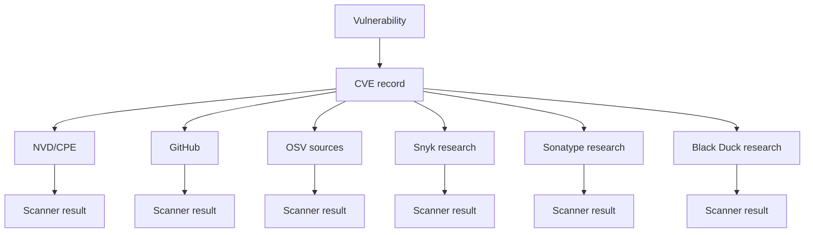

Each branch can have:

- different affected versions
- different timing
- different package identities
- different assumptions about EOL software
- different research depth
- different downstream/vendor knowledge

The vulnerability ecosystem is therefore **eventually consistent**, not instantly authoritative.

---

# 22. Why EOL software makes the problem worse

EOL software removes one of the most important sources of vulnerability intelligence:

> the maintainer who still cares about that release.

Before EOL:

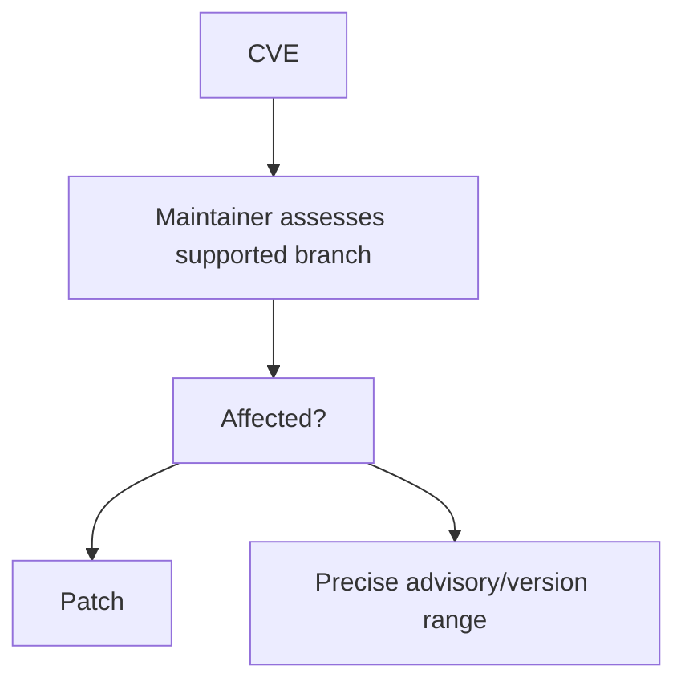

After EOL:

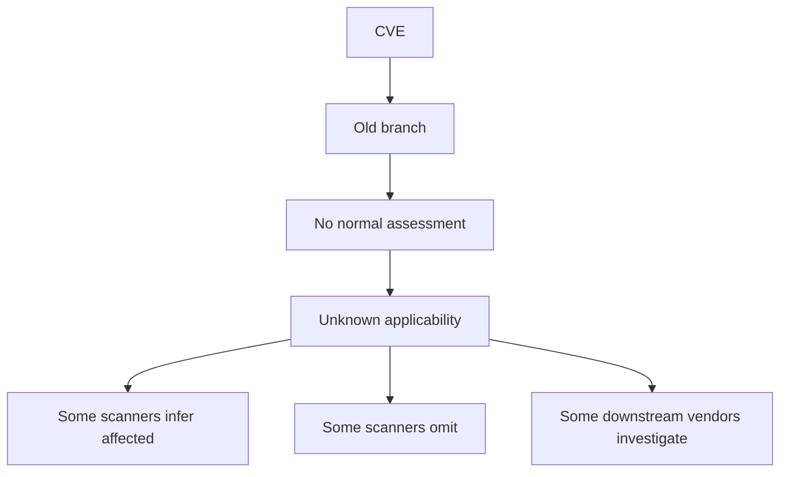

This is why “the scanner found nothing” becomes a weaker assurance as software ages.

---

# 23. The CPE problem

CPE tries to describe affected products.

But modern software is not a clean list of products. It is a graph of:

- upstream releases
- forks
- embedded components
- repackaged artifacts
- vendor branches
- backports
- private patches
- renamed distributions

CPE does not maintain authoritative software genealogy.

That means the flow is often:

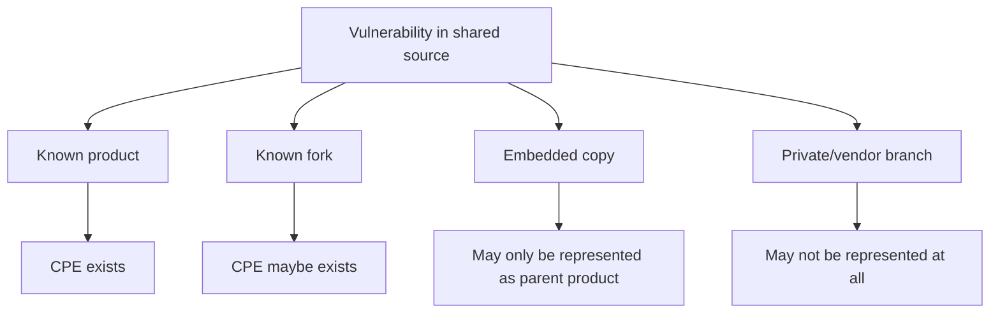

This becomes particularly brittle when the original upstream release is EOL and no longer actively mapped.

---

# 24. The main conclusions

## Conclusion 1 — CVE is not a dependency graph

CVE does not know:

- that TomEE contains Tomcat
- that Electron embeds Node
- that Valkey shares historical Redis code
- that AWS-LC descends from BoringSSL, which descends from OpenSSL
- that a vendor kernel contains a backported mainline function
- that a private enterprise fork still contains vulnerable code

Those relationships are reconstructed by maintainers, vendors and scanners.

---

## Conclusion 2 — “not listed” is not “not affected”

For old releases, absence from a CVE affected-version range can mean:

- not affected
- not assessed
- forgotten
- intentionally excluded because unsupported
- not yet curated
- represented under a different package/product identity
- known only to a downstream vendor

These states are not equivalent.

---

## Conclusion 3 — independent scanner research helps, but does not solve the problem

Sonatype, Black Duck and Snyk all explicitly describe research beyond public CVE feeds.

That is valuable.

But the Tomcat comparison shows that even independently curated intelligence can omit old versions that another database correctly includes.

There is no single guaranteed source of truth.

---

## Conclusion 4 — OSV can contain conflicting levels of completeness

OSV is powerful because it aggregates ecosystem-specific intelligence.

But that also means two OSV records for the same CVE can expose different version ranges.

Consumers need to understand the source record, not just the CVE identifier.

---

## Conclusion 5 — the most dangerous point is after maintenance stops

When a release is supported, someone is still responsible for answering:

> Is this release affected?

After EOL, that responsibility may disappear.

The vulnerable code does not disappear with it.

---

# 25. Practical implications for developers and security teams

A mature vulnerability-management process should not rely on one scanner alone for unsupported software.

For old or critical components, consider:

1. Check the upstream project security advisory.
2. Check the CNA-authored CVE data.
3. Check NVD/CPE, but do not assume it is complete.
4. Check GitHub Advisory Database if the component is packaged in an ecosystem GitHub supports.
5. Check OSV and inspect which source records are producing the answer.
6. Check at least one enriched commercial intelligence source if available.
7. Check downstream/vendor advisories where the component is embedded or repackaged.
8. Treat EOL as a separate risk signal even when there are no known CVEs.
9. Where a branch is unsupported, consider source-level or patch-level comparison for high-severity vulnerabilities.
10. Record uncertainty explicitly rather than turning “unknown” into “not affected.”

---

# 26. A better mental model for workshops

The simplest useful model is:

```mermaid
flowchart TD
    S[Software source history] --> V[Vulnerability exists]
    V --> D[Someone discovers it]
    D --> CNA[CNA / CVE]
    CNA --> NVD[NVD / CPE]
    CNA --> GH[GitHub advisories]
    CNA --> OSV[OSV sources]
    CNA --> CI[Commercial intelligence]

    S --> F1[Fork]
    S --> F2[Embedded copy]
    S --> F3[Vendor branch]
    S --> F4[EOL release]

    NVD --> SC[Scanner]
    GH --> SC
    OSV --> SC
    CI --> SC

    F1 --> Q1[Was it assessed?]
    F2 --> Q2[Was it identified?]
    F3 --> Q3[Did vendor backport?]
    F4 --> Q4[Does anyone still maintain it?]
```

The CVE database sees only part of that graph.

---

# 27. Suggested workshop demonstration

A defensible hands-on demo does not require access to every commercial product.

Create two minimal Maven projects:

```text
tomcat-8.5.100/
tomcat-7.0.109/
```

Use a Tomcat artifact that appears in the public vulnerability records being compared.

Then compare:

- GitHub Advisory Database
- OSV
- Snyk's public vulnerability database
- NVD
- Apache Tomcat's own security documentation

Suggested CVEs:

- CVE-2024-38286
- CVE-2025-24813
- CVE-2024-50379

The teaching goal is not to prove one scanner is “best.”

The teaching goal is to show:

```text
same software
same CVE
different data source
different answer
```

Then ask:

> Which answer would your CI pipeline have acted on?

---

# 28. Strong statements that the evidence supports

The following statements are defensible based on the research:

> A CVE is an identifier and vulnerability record; it is not a software genealogy system.

> CVE and CPE data do not automatically propagate vulnerability applicability across forks, embedded copies and vendor branches.

> EOL releases can remain vulnerable after upstream stops evaluating or patching them.

> The absence of an old release from a CVE affected-version range is not proof that the release is unaffected.

> Commercial vulnerability-intelligence providers often perform independent version-range research, but their conclusions can still differ.

> Public databases can disagree about the same CVE because they are independently curated and updated at different times.

> A scanner can be correct according to its data source and still miss a real vulnerability in an old release.

---

# 29. Statements to avoid overclaiming

The research does **not** justify saying:

> “Commercial scanners always detect EOL vulnerabilities.”

They do not.

It also does not justify:

> “NVD always misses old versions.”

It does not.

Nor:

> “OSV has the correct answer.”

OSV may contain several answers from several sources.

And it does not justify:

> “A scanner miss proves the scanner is bad.”

The missing information may never have existed in the scanner's upstream data source.

A better statement is:

> **Vulnerability detection quality depends on the quality, coverage and interpretation of the underlying intelligence, and EOL software removes many of the mechanisms that keep that intelligence current.**

---

# 30. Primary sources used

## Project security/support policies

- Apache Tomcat security: <https://tomcat.apache.org/security-8.html>
- Apache HTTP Server 2.2 security: <https://httpd.apache.org/security/vulnerabilities_22.html>
- Node.js EOL policy: <https://nodejs.org/en/about/eol>
- Node.js release lifecycle: <https://nodejs.org/en/about/previous-releases>
- Python security policy: <https://devguide.python.org/security/policy/>
- Python development lifecycle: <https://devguide.python.org/developer-workflow/development-cycle/>
- Django supported versions: <https://www.djangoproject.com/download/>
- Django security process: <https://docs.djangoproject.com/en/6.1/internals/security/>
- PostgreSQL versioning: <https://www.postgresql.org/support/versioning/>
- PostgreSQL security: <https://www.postgresql.org/support/security/>
- Kubernetes version policy: <https://kubernetes.io/releases/version-skew-policy/>
- Kubernetes security response: <https://github.com/kubernetes/committee-security-response>
- Go release policy: <https://go.dev/doc/devel/release>
- OpenSSL release strategy: <https://openssl-library.org/policies/releasestrat/>
- OpenSSL vulnerabilities: <https://openssl-library.org/news/vulnerabilities/>
- Linux releases: <https://www.kernel.org/releases.html>
- Linux stable rules: <https://www.kernel.org/doc/html/latest/process/stable-kernel-rules.html>
- Linux security bugs: <https://www.kernel.org/doc/html/latest/process/security-bugs.html>
- Spring Framework security: <https://github.com/spring-projects/spring-framework/security>
- Spring versions: <https://github.com/spring-projects/spring-framework/wiki/Spring-Framework-Versions>
- Redis security: <https://github.com/redis/redis/security>
- Valkey security: <https://github.com/valkey-io/valkey/security>

## Fork/variant examples

- BoringSSL: <https://boringssl.googlesource.com/boringssl>
- AWS-LC: <https://github.com/aws/aws-lc>
- LibreSSL portable: <https://github.com/libressl/portable>
- TomEE security: <https://tomee.apache.org/security/security.html>
- Electron timelines: <https://www.electronjs.org/docs/latest/tutorial/electron-timelines>

## Scanner/data-source documentation

- Sonatype vulnerability data: <https://help.sonatype.com/en/sonatype-vulnerability-data.html>
- Sonatype Component EOL: <https://help.sonatype.com/en/component-end-of-life.html>
- Sonatype research methodology: <https://www.sonatype.com/state-of-the-software-supply-chain/2026/methodology>
- Snyk vulnerability database: <https://docs.snyk.io/scan-with-snyk/snyk-open-source/manage-vulnerabilities/snyk-vulnerability-database>
- Snyk patches: <https://docs.snyk.io/scan-with-snyk/snyk-open-source/manage-vulnerabilities/snyk-patches-to-fix-vulnerabilities>
- JFrog contextual analysis: <https://jfrog.com/help/>
- Grype ecosystem feeds: <https://oss.anchore.com/docs/guides/vulnerability/ecosystems/>
- GitHub Dependabot vulnerability detection: <https://docs.github.com/en/code-security/reference/supply-chain-security/troubleshoot-dependabot/vulnerability-detection>
- Black Duck documentation: <https://docs.blackduck.com/>

## CVE comparison cases

- CVE-2024-38286: <https://nvd.nist.gov/vuln/detail/CVE-2024-38286>
- GitHub CVE-2024-38286 mapping: <https://github.com/advisories/GHSA-7jqf-v358-p8g7>
- Snyk CVE-2024-38286 mapping: <https://security.snyk.io/vuln/SNYK-JAVA-ORGAPACHETOMCAT-8073089>
- CVE-2026-24880 GitHub: <https://github.com/advisories/GHSA-563x-q5rq-57qp>
- CVE-2026-24880 Snyk: <https://security.snyk.io/vuln/SNYK-JAVA-ORGAPACHETOMCAT-15990632>
- CVE-2026-24880 OSV: <https://osv.dev/vulnerability/BIT-tomcat-2026-24880>
- CVE-2026-59083 GitHub: <https://github.com/advisories/GHSA-hcjr-322h-429r>
- CVE-2026-59083 Snyk: <https://security.snyk.io/vuln/SNYK-JAVA-ORGAPACHETOMCAT-19348777>
- CVE-2025-24813 OSV: <https://osv.dev/vulnerability/CVE-2025-24813>
- CVE-2025-24813 GitHub: <https://github.com/advisories/GHSA-83qj-6fr2-vhqg>
- CVE-2025-24813 Snyk: <https://security.snyk.io/vuln/SNYK-JAVA-ORGAPACHETOMCAT-9380766>
- CVE-2024-50379 OSV: <https://osv.dev/vulnerability/CVE-2024-50379>
- CVE-2024-50379 GitHub: <https://github.com/advisories/GHSA-5j33-cvvr-w245>
- CVE-2024-50379 Snyk: <https://security.snyk.io/vuln/SNYK-JAVA-ORGAPACHETOMCAT-8523184>
- CVE-2025-59466 OSV: <https://osv.dev/vulnerability/CVE-2025-59466>
- CVE-2025-59466 Snyk: <https://security.snyk.io/vuln/SNYK-UPSTREAM-NODE-14975915>

---

# 31. Bottom line

The software supply chain is a graph.

The vulnerability ecosystem mostly records it as lists.

That mismatch becomes increasingly important when software:

- forks
- is embedded
- is repackaged
- is privately patched
- leaves upstream support

The CVE system can tell us that a vulnerability exists.

It cannot, by itself, tell us every place that vulnerable code still exists.

That is why old software can be dangerous even when every scanner on the dashboard is green.
