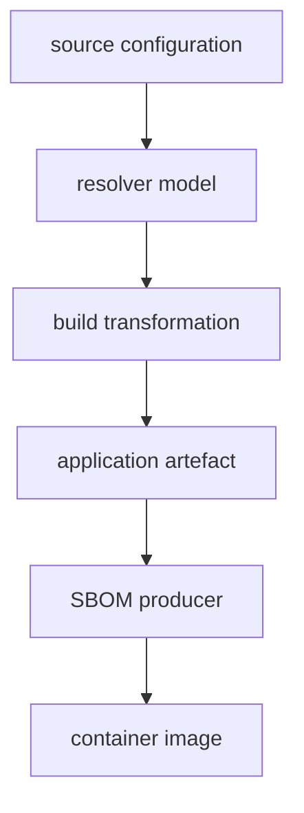

# About This Workshop

> *Every project has dependencies it knows about. Most have dependencies it
> doesn't.*

This is the manual for the hands-on workshop of the same name: a session
about what you can and cannot know about the software you ship.

## The question

You declare a dependency. It gets resolved, compiled, shaded, bundled,
packaged, containerised. At the far end, a scanner tells you what your
application contains.

How much of that answer is actually true?

Every lab here takes a component you declared, follows it through a real build,
and asks the same question at each boundary:

```text
is it still identifiable here?
```

Sometimes it is. Often the code survives while the evidence of what it *was*
does not.

## Why this matters

An SBOM, a dependency tree, a scanner report and a container inventory get
treated as interchangeable descriptions of "what is in this application". They
are not. Each is an **observation, made at a particular point in the supply
chain, from a particular evidence source**.



They routinely disagree, and usually for entirely legitimate reasons. The
recurring finding across every lab is:

```text
software presence  !=  software identifiability
```

A build can preserve behaviour perfectly while destroying every trace of where
that behaviour came from. If you only ever look at one boundary, you will
believe things about your software that are not true.

## The approach

**Real builds.** The applications are deliberately tiny.
The builds are not simulated: Maven, npm, Vite, esbuild, Maven Shade, Spring
Boot, PEP 517 backends, npm lifecycle hooks, Docker. Nothing is stubbed, because
the whole point is what real tooling actually does to real artefacts.

**Named tracers.** Each scenario plants a small number of named
components and follows only those. Instead of hunting through thousands of
dependencies, you watch three or four specific things cross five or six
specific boundaries.

**Evidence over assertion.** Every claim in a walkthrough is backed by a command
you run and output you can see. Where a step proves something, it says what it
proves. Where a step only shows correlation, it says that too.

**Controlled experiments.** Where a result could be coincidence, the lab changes
one thing and repeats the observation. S01, for example, strips only the
identifying Maven metadata from a shaded JAR, leaving the bytecode untouched,
and rescans. The difference is then attributable to the evidence removed, not to
the code.

## How the workshop is organised

**Five scenarios (S01–S05).** Each builds a supply chain that hides software
somewhere different: bytecode relocation, a Maven plugin execution realm, a
PEP 517 build backend, an npm lifecycle hook, a frontend bundler.

**Seven investigations (T01–T07).** Each points a real tool (Snyk, Docker
Scout, Trivy, Grype, pip-audit, OWASP Dependency-Check, npm audit) at those
scenarios and asks what that tool can actually see.

The investigations are not a ranking. Each tool observes a particular boundary
using a particular evidence source, and does so competently. The interesting
question is which boundary, and therefore what becomes visible or invisible as a
consequence.

Every scenario and investigation is one document, `TRACE.md`: what it is,
what it needs, how to run it, and the annotated step-by-step walkthrough.

## How to read a trace

The two kinds of lab read differently, and the beats tell you which kind you
are in.

A **scenario walkthrough** follows software through a real build: its steps
are narrative — five beats each, so you always know which part is argument and
which part is evidence:

```text
Why                the question this step answers
Approach           what the command does, and why this one
Run                the command
Observed output    what it actually printed
Establish          what that does and does not prove
```

An **investigation** points one tool at those scenarios, so it reads as an
experiment report instead. It opens with ground truth — what the scenario
actually contains, established independently of the tool — and then runs a
series of probes, each falsifiable because its prediction is stated before its
result:

```text
Question       what this probe asks of the tool
Expectation    what ground truth predicts, stated before the output
Observed       what the tool actually reported
Verdict        seen or missed, and what that does and does not prove
```

Every investigation ends with a scorecard — tracer by tracer, boundary by
boundary, what the tool identified — and the scorecards share a vocabulary so
the tools can be laid side by side.

In both kinds, the observed-output blocks are real captured output, not
illustrations. If yours differs, that is worth investigating rather than
ignoring. Note that tool versions and vulnerability databases move, so counts
in particular will drift. The `Establish` and `Verdict` sections are written to
survive that drift; the exact numbers are not.

## What you should take away

By the end you should be able to say, about your own systems:

```text
which boundary produced this inventory
what evidence that producer had access to
what it therefore cannot tell me
what additional evidence would answer the question I actually have
```

That last point is the practical one. Several labs end with software that is
provably present in the shipped artefact and provably invisible to the tool
being used. Knowing *which* additional evidence recovers it (build logs, a
plugin ClassRealm, a lockfile, the physical archive) is the transferable skill.

## Scope

The labs end at the container-image boundary.

Reverse provenance (starting from a binary or container and determining the
source repository and exact commit that produced it) is a different and harder
problem, and is deliberately left for a separate exercise.

## Before you start

Work through the rest of this section in order. The short version, from the
repository root:

```bash
./scripts/tools-check.sh    # what is installed, what is missing, how to get it
./scripts/build-all.sh      # every download, image pull and compile
```

Run the second one **before** the workshop, on a good network. It is the
difference between starting on time and watching Maven download.
